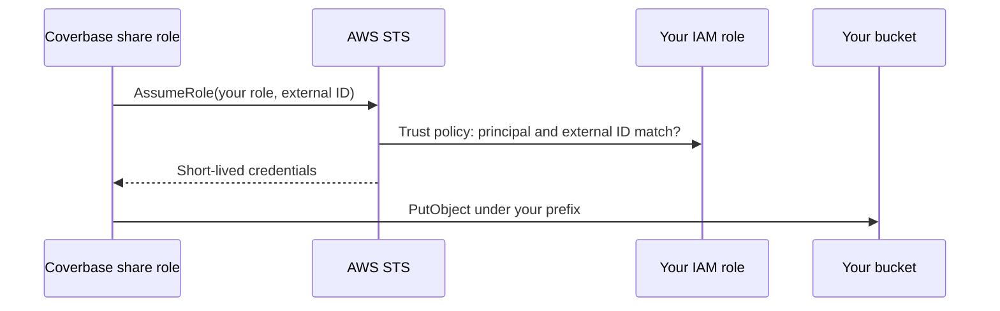

import AgentDirective from "/snippets/agent-directive.mdx";
import BetaConnector from "/snippets/beta-connector.mdx";

<AgentDirective />

<BetaConnector />

An Amazon S3 destination is part of [warehouse data share](/products/warehouse-data-share). Coverbase stores no secret for it. It assumes an IAM role in your account, using an external ID generated for that one destination, and writes files under the prefix you choose.

## How access works



- **One principal.** Your role trusts a single, dedicated Coverbase role that exists only to assume customer share roles. The destination card shows it under **AWS principals your role must trust**. Coverbase's services reach your role only through it.
- **One external ID per destination.** It is generated when you save the destination, starts with `coverbase-`, and is shown on the card. Coverbase's share role may only assume a role that demands a `coverbase-` external ID and sits outside Coverbase's own AWS account, and yours demands this destination's, so your role cannot be used for another customer's destination. A role ARN in Coverbase's own account is refused when you save.

## Prepare the bucket and role

1. Choose a bucket and a prefix for Coverbase's files.
2. Create an IAM role with a policy that allows `s3:PutObject` under that prefix, for example:

```json
{
  "Version": "2012-10-17",
  "Statement": [
    {
      "Effect": "Allow",
      "Action": "s3:PutObject",
      "Resource": "arn:aws:s3:::your-bucket/coverbase/*"
    }
  ]
}
```

You finish the role's trust policy after saving the destination in Coverbase, when the external ID exists.

## Add the destination in Coverbase

1. Open **Configuration → Data Share** and click **Add destination**.
2. Choose **Amazon S3**, give it a **Name**, and choose **Hourly** or **Daily**.
3. Enter the **Bucket**, **Prefix**, **Region** and **IAM Role ARN**, and choose the **File Format**: **CSV (gzip)**, **JSON Lines (gzip)** or **Parquet (snappy)**.
4. Click **Add destination**.
5. On the destination card, click **Copy trust policy** and set it as your role's trust policy. It has this shape, with the principal and external ID filled in:

```json
{
  "Version": "2012-10-17",
  "Statement": [
    {
      "Effect": "Allow",
      "Principal": { "AWS": "<principal from the card>" },
      "Action": "sts:AssumeRole",
      "Condition": { "StringEquals": { "sts:ExternalId": "coverbase-<from the card>" } }
    }
  ]
}
```

6. Click **Test connection**, then **Sync now**.

## What lands in the bucket

- Files at `<prefix>/<table>/synced_date=YYYY-MM-DD/<run id>-<page>.<ext>`, in the format you chose.
- Each table's contract at `<prefix>/_contract/<table>.json`.
- Each sync appends the rows that changed, stamped with `_cb_synced_at`. Deduplicate on `id`, keeping the latest `_cb_synced_at`. The `services` table is a full snapshot on every run.

## Related

<CardGroup cols={2}>
  <Card title="Data share guide" icon="book-open" href="/user-guides/warehouse-data-share">
    Run logs, pausing and the table contract.
  </Card>
  <Card title="Integration credentials and signing" icon="key" href="/security/integration-credentials#customer-s3-roles-and-external-ids">
    Why the external ID matters.
  </Card>
  <Card title="Snowflake" icon="snowflake" href="/integrations/guides/snowflake">
    The Snowflake destination.
  </Card>
  <Card title="BigQuery" icon="table" href="/integrations/guides/bigquery">
    The BigQuery destination.
  </Card>
</CardGroup>
