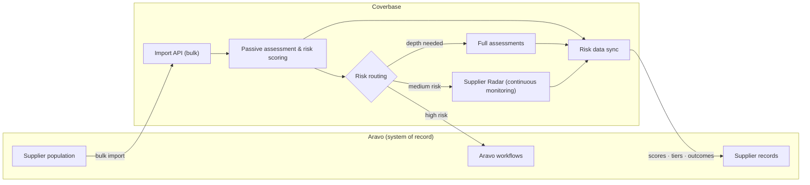
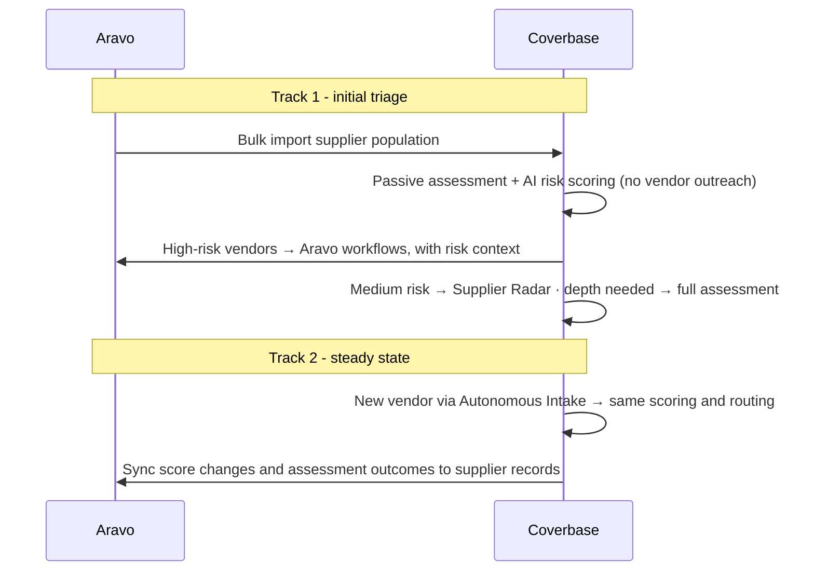

import AgentDirective from "/snippets/agent-directive.mdx";

<AgentDirective />

Coverbase deploys alongside **Aravo** as the risk-triage and intelligence layer: Coverbase absorbs the vendor population, assesses and scores it with AI, and routes each vendor to the right treatment - Aravo's workflows for the vendors that warrant them, continuous monitoring for the middle of the book, full assessments where depth is needed - while keeping Aravo's supplier records current with the latest risk data. Your Aravo investment keeps doing what it does well; Coverbase answers the question Aravo can't: *which of these thousands of vendors actually deserve the workflow?*

This architecture runs on Coverbase's shipped integration surfaces - the [Import API](/import-api), [Zero Touch Assessments](/products/zero-touch-assessments), [Supplier Radar](/products/supplier-radar), the [workflow engine](/integrations/workflow-engine), and the [Export API](/export-api-concepts) - configured to your Aravo tenant during onboarding.

## The two tracks

**Track 1 - triage the existing population.** Most Aravo estates carry a large vendor population with no current risk assessment. The full population bulk-imports into Coverbase, where passive assessments and AI risk scoring triage every vendor without sending anyone a questionnaire. The output is a tiered book: high-risk vendors route into Aravo's workflows with their risk context attached, medium-risk vendors go under Supplier Radar's continuous monitoring, and the vendors that need real depth get full Coverbase assessments.

**Track 2 - steady state.** New vendors enter through [Autonomous Intake](/products/autonomous-intake) and flow through the same scoring and routing automatically, so the triage never goes stale. Score changes - a monitoring alert, a completed assessment, a reassessment - sync back to the Aravo supplier record.

## Trigger model

## Why triage-first works

- **No outreach cost for the long tail.** Passive assessment scores vendors from external signals and existing evidence - the majority of a large population is tiered without a single questionnaire sent.
- **Aravo gets fewer, better-qualified cases.** Its workflows receive the vendors that warrant them, each arriving with its risk score, tier, and the evidence behind them.
- **Nothing falls out of view.** The middle of the book isn't parked - Supplier Radar watches it continuously, and a deteriorating vendor is promoted into a real review automatically through the workflow engine.
- **The record of record stays current.** Risk data flows back to Aravo on every change, keyed on Aravo's supplier identifiers, so downstream Aravo reporting reflects live risk rather than the last manual review.

## Authentication and provisioning

The bulk import and steady-state pushes authenticate with an org-scoped Coverbase service-account API key. The sync back to Aravo is configured against your Aravo tenant's API during onboarding, with credentials held in Coverbase's secrets manager.

## Onboarding checklist

1. A supplier extract from Aravo (or API access) for the initial bulk import - Aravo supplier IDs included, so every record round-trips.
2. Your risk-tier thresholds: which scores route to Aravo workflows, monitoring, or full assessment.
3. Aravo API credentials for the risk-data sync back to supplier records.
4. The intake path for new vendors (Autonomous Intake, or a push from your procurement stack - see [integration patterns](/integrations/patterns)).
