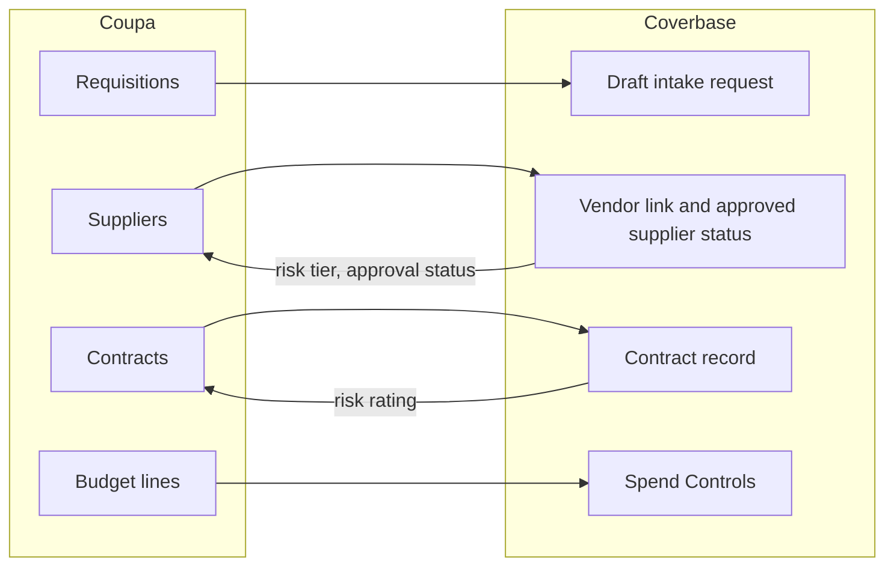

import AgentDirective from "/snippets/agent-directive.mdx";

<AgentDirective />

The Coupa connector is part of the [Integration Hub](/products/integration-hub). It reads Coupa's Core API on a schedule and writes Coverbase's view of each supplier and contract back to custom fields you name.

## What it does

| Coupa object | Direction | What happens in Coverbase |
| --- | --- | --- |
| Requisitions | In | A draft intake request with the requisition's total, commodity and requester, shown to the Front Door as **Started From Procurement**. You choose which requisition statuses open one. |
| Suppliers | In | Linked to a vendor on tax ID or D-U-N-S, or on website when nothing stronger disagrees. The supplier's `approved-supplier` custom field, or its status, sets the vendor's approved supplier status for Coupa. |
| Suppliers | Out | Risk tier and approval status, written to the supplier custom fields you name. |
| Contracts | In | Start date, end date and maximum value. A contract Coupa reports as published is marked executed in Coverbase. |
| Contracts | Out | Risk rating (the vendor's residual risk, else its tier), and optionally the required clause pack and blocking issues, written to the contract custom fields you name. |
| Budget lines | In | Budget amount and committed spend, shown on **Spend Controls** and used by the intake budget step. |

Syncs read only records updated since the last successful sync. Outbound values are written only when they changed since the last push.

## Authentication

Coupa uses OAuth 2.0 client credentials (Coupa's OIDC client) at `<your instance>/oauth2/token`.

1. In Coupa, create an OAuth client with the client credentials grant and these scopes: `core.supplier.read`, `core.supplier.write`, `core.requisition.read`, `core.contract.read`, `core.contract.write` and `core.budget.read`. Coverbase asks for all six when it requests a token, so grant all six even if you leave write-back off.
2. Create the custom fields Coverbase will write to on suppliers and contracts, for example `coverbase_risk_tier`, `coverbase_approval_status` and `coverbase_risk_rating`.

## Set up in Coverbase

1. Open **Configuration → External Integrations** and click **Coupa**.
2. On **Authentication**, enter the **Instance URL**, **Client ID** and **Client secret**.
3. Turn on **Open an intake request for each new requisition** if you want one, and pick the **Requisition Statuses**.
4. Turn on **Write risk tier, approval status and contract values back to the provider** for two-way sync.
5. Set **Sync Interval (Minutes)** and click **Save**, then **Test connection**.
6. On **Field Mappings**, put your Coupa custom field API names in each outbound row's **Target**, and **Save mappings**.
7. Click **Sync now** and read the **Sync Log**.

## Webhooks

Coupa does not sign outbound calls the way Coverbase requires. To have a record change trigger a sync, put middleware (an integration platform or a small function) between Coupa and Coverbase that signs each call with the connection's signing secret. See [Set up the webhook](/user-guides/integration-hub#step-3-set-up-the-webhook-optional). Without one, the scheduled sync picks up every change.

## Onboarding checklist

1. An OAuth client with the scopes above.
2. Custom fields on suppliers and contracts for the values Coverbase writes back.
3. Agreement on which requisition statuses should open an intake request.
4. A steward to work the steward queue for suppliers that do not match.

## Related

<CardGroup cols={2}>
  <Card title="Integration Hub guide" icon="book-open" href="/user-guides/integration-hub">
    Field mappings, the sync log and the steward queue.
  </Card>
  <Card title="Front Door triage" icon="door-open" href="/user-guides/front-door-triage">
    Where a synced requisition is reviewed.
  </Card>
  <Card title="SAP Ariba" icon="cart-shopping" href="/integrations/guides/sap-ariba">
    The other procure-to-pay connector.
  </Card>
  <Card title="Integration credentials and signing" icon="key" href="/security/integration-credentials">
    How the client secret and signing secret are kept.
  </Card>
</CardGroup>
