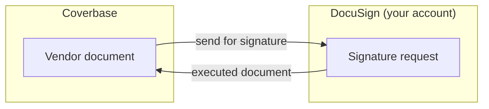

import AgentDirective from "/snippets/agent-directive.mdx";

<AgentDirective />

Coverbase connects to **DocuSign** so documents that come out of the vendor lifecycle — agreements, attestations, approval sign-offs — go out for signature without leaving the platform, through your organization's own DocuSign account.

## What it does

- **Send for signature from the document itself.** A vendor document in Coverbase can be sent for e-signature directly, with the signature request created in your DocuSign account.
- **Your account, your audit trail.** Envelopes live in your DocuSign tenant, so your existing DocuSign retention, compliance, and audit posture applies unchanged.
- **Multi-account aware.** Users who belong to several DocuSign accounts pick which one to send from; Coverbase respects DocuSign's account membership rather than assuming one.

## Authentication and provisioning

The connection uses DocuSign's standard OAuth authorization flow: a user authorizes Coverbase against your DocuSign tenant from the **Configuration → External integrations** page, and Coverbase acts only with the access that grant carries. No passwords are stored; tokens are held in Coverbase's secrets manager.

## Onboarding checklist

1. A DocuSign account with API access enabled (standard on business plans).
2. A user with sending rights completes the OAuth authorization from the integrations page.
3. That's it — sending is available from the document actions immediately.
