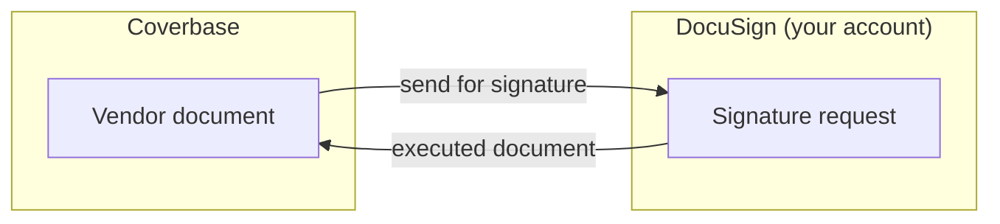

import AgentDirective from "/snippets/agent-directive.mdx";

<AgentDirective />

Coverbase connects to **DocuSign** so documents that come out of the vendor lifecycle - agreements, attestations, approval sign-offs - go out for signature without leaving the platform, through your organization's own DocuSign account.

There are two places you can send from, and they behave the same once the envelope is out:

- **From a contract.** The contract's **Execution** section, once the contract has cleared its approval chain. This is the path described in [Contract intake and approval](/user-guides/contract-intake-and-approval).
- **From a vendor document.** The document's actions menu, for anything that is not a contract record.

## What it does

- **Initiate execution from the document itself.** A vendor document in Coverbase is sent for e-signature directly from its actions menu, with the envelope created in your DocuSign account. No download, no re-upload, no separate system to open.
- **Route countersignature.** Up to five signer slots are supported, each mapped to a numbered anchor in the document. Each signer carries an **order** value: signers sharing an order sign in parallel, and increasing order values route sequentially, which is how a counterparty-then-countersignature flow is expressed. Assign the vendor signer order `1` and your own authorized signatory order `2`, and the envelope reaches your side only once the counterparty has signed.
- **Track the request on the third-party record.** The signature request is stored against the Coverbase document it was raised from, carrying the DocuSign envelope ID, the recipients, and the request status as it moves through **sent**, **signed**, **completed** and **declined**. The status of an in-flight execution is a field on the record rather than something to go and look up.
- **The executed agreement stays bound to the record.** Because the envelope is created **from** a Coverbase vendor document, the fully executed agreement is attached to that third party's record by construction, not by someone remembering to file it. From there it flows into the contract family: [Contract Guardian](/products/contract-guardian) runs the clause review, [Document Insights](/products/document-insights) extracts dates, values, notice periods and liability caps, and obligations are tracked against it.
- **Your account, your audit trail.** Envelopes live in your DocuSign tenant, so your existing DocuSign retention, compliance, and audit posture applies unchanged, including the DocuSign certificate of completion.
- **Multi-account aware.** Users who belong to several DocuSign accounts pick which one to send from; Coverbase respects DocuSign's account membership rather than assuming one.

## Preparing a document for signature

Coverbase maps signer slots using numbered anchor tags placed in the document text, so fields land where your paper puts them rather than where a template guesses.

| Field | Anchor tags |
| --- | --- |
| Signature, required per signer slot | `/sn1/` through `/sn5/` |
| Signed date, filled automatically | `/date_signed1/` through `/date_signed5/` |
| Date, recipient-editable | `/date1/` through `/date5/` |
| Title, recipient-editable | `/title1/` through `/title5/` |
| Organization, recipient-editable | `/organization1/` through `/organization5/` |

Each signer needs a unique signature anchor and a unique email address. Coverbase validates both before sending, and refuses a document whose anchors are missing rather than producing an envelope with nowhere to sign.

<Tip>
  Put the anchor set into your standard MSA, DPA and order-form templates once. Every agreement generated from them is then sendable with no preparation step at all.
</Tip>

## Connecting your account

Connecting is per person, not per organization. Each sender authorizes Coverbase against their own DocuSign login, so envelopes carry the right sender and your DocuSign permissions apply unchanged.

<Steps>
  <Step title="Open a send screen">
    Go to a contract's **Execution** section and click **Send to DocuSign**, or open a vendor document's actions menu and choose **Send for signature**. If you are not connected yet, Coverbase says so and offers **Connect DocuSign**.
  </Step>
  <Step title="Authorize in DocuSign">
    Clicking **Connect DocuSign** opens DocuSign in a new tab. Sign in with your normal DocuSign credentials and grant Coverbase access. Coverbase never sees your DocuSign password.
  </Step>
  <Step title="Come back">
    DocuSign returns you to the screen you started from. The send dialog now shows your connected account instead of the connect prompt.
  </Step>
  <Step title="Pick the account, if you have several">
    People who belong to more than one DocuSign account get an account selector. Coverbase preselects the account your organization configured, falls back to your DocuSign default, and lets you change it per send.
  </Step>
</Steps>

<Note>
  **If you belong to several DocuSign accounts and your organization has configured one you are not a member of**, Coverbase warns you and uses your own default instead of failing the send. Ask your DocuSign administrator to add you to the configured account if envelopes should be raised there.
</Note>

### Setting the organization account

An administrator sets which DocuSign account the organization sends from under **Configuration → External integrations → DocuSign**. This is a default, not a restriction: senders may still pick another account they belong to.

### Disconnecting

The send dialog's account card has a **Disconnect** action. It clears the connection in your browser only. Envelopes already in flight are unaffected, and reconnecting takes one authorization round trip.

<Warning>
  **Your connection is stored in the browser you connected from.** Switching browsers, clearing site data, or using a different machine means connecting again. This is deliberate: nothing about your personal DocuSign session is stored server-side.
</Warning>

## Keeping status in step

Once an envelope is out, three things keep Coverbase's copy of its status honest:

| Mechanism | When it runs |
| --- | --- |
| **DocuSign Connect** | Immediately, as DocuSign moves the envelope. Coverbase verifies the signature on every callback and rejects anything unsigned. |
| **Scheduled reconciliation** | On a schedule, re-reading every envelope that is still in flight. This is the safety net for a callback that never arrived. |
| **Sync status** | On demand, from the button on the envelope, for when you are watching a signature land. |

Ask your Coverbase contact to enable DocuSign Connect for your account if envelope statuses only update when you press **Sync status**.

## Onboarding checklist

1. A DocuSign account with API access enabled (standard on business plans).
2. Each sender authorizes Coverbase from a send screen, as above.
3. An administrator sets the organization's DocuSign account under **Configuration → External integrations**, if you want a shared default.
4. Anchor tags added to the document templates you intend to send.
5. DocuSign Connect enabled, so statuses update without anyone pressing a button.

## Related

<CardGroup cols={2}>
  <Card title="Contract Guardian" icon="file-contract" href="/products/contract-guardian">
    Clause review before execution, and re-evaluation on amendment.
  </Card>
  <Card title="Contract intake and approval" icon="clipboard-check" href="/user-guides/contract-intake-and-approval">
    Raising a request, confirming its values, and the approval chain before a send.
  </Card>
  <Card title="Contracts workspace" icon="folder-open" href="/user-guides/contracts-workspace">
    Where the executed agreement lands, and what the record then tracks.
  </Card>
  <Card title="Contract dates and reminders" icon="calendar-check" href="/user-guides/contract-dates-and-reminders">
    Notice windows and renewal deadlines derived from the executed paper.
  </Card>
  <Card title="Integration directory" icon="grid-2" href="/integrations/directory">
    The other CLM and e-signature platforms Coverbase connects with.
  </Card>
</CardGroup>
