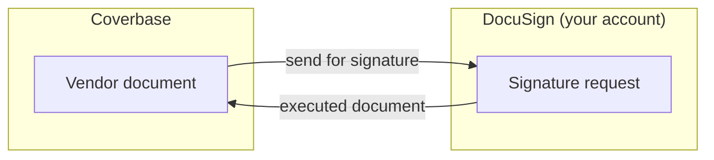

import AgentDirective from "/snippets/agent-directive.mdx";

<AgentDirective />

Coverbase connects to **DocuSign** so documents that come out of the vendor lifecycle - agreements, attestations, approval sign-offs - go out for signature without leaving the platform, through your organization's own DocuSign account.

## What it does

- **Initiate execution from the document itself.** A vendor document in Coverbase is sent for e-signature directly from its actions menu, with the envelope created in your DocuSign account. No download, no re-upload, no separate system to open.
- **Route countersignature.** Up to five signer slots are supported, each mapped to a numbered anchor in the document. Each signer carries an **order** value: signers sharing an order sign in parallel, and increasing order values route sequentially, which is how a counterparty-then-countersignature flow is expressed. Assign the vendor signer order `1` and your own authorized signatory order `2`, and the envelope reaches your side only once the counterparty has signed.
- **Track the request on the third-party record.** The signature request is stored against the Coverbase document it was raised from, carrying the DocuSign envelope ID, the recipients, and the request status as it moves through **sent**, **signed**, **completed** and **declined**. The status of an in-flight execution is a field on the record rather than something to go and look up.
- **The executed agreement stays bound to the record.** Because the envelope is created **from** a Coverbase vendor document, the fully executed agreement is attached to that third party's record by construction, not by someone remembering to file it. From there it flows into the contract family: [Contract Guardian](/products/contract-guardian) runs the clause review, [Document Insights](/products/document-insights) extracts dates, values, notice periods and liability caps, and obligations are tracked against it.
- **Your account, your audit trail.** Envelopes live in your DocuSign tenant, so your existing DocuSign retention, compliance, and audit posture applies unchanged, including the DocuSign certificate of completion.
- **Multi-account aware.** Users who belong to several DocuSign accounts pick which one to send from; Coverbase respects DocuSign's account membership rather than assuming one.

## Preparing a document for signature

Coverbase maps signer slots using numbered anchor tags placed in the document text, so fields land where your paper puts them rather than where a template guesses.

| Field | Anchor tags |
| --- | --- |
| Signature, required per signer slot | `/sn1/` through `/sn5/` |
| Signed date, filled automatically | `/date_signed1/` through `/date_signed5/` |
| Date, recipient-editable | `/date1/` through `/date5/` |
| Title, recipient-editable | `/title1/` through `/title5/` |
| Organization, recipient-editable | `/organization1/` through `/organization5/` |

Each signer needs a unique signature anchor and a unique email address. Coverbase validates both before sending, and refuses a document whose anchors are missing rather than producing an envelope with nowhere to sign.

<Tip>
  Put the anchor set into your standard MSA, DPA and order-form templates once. Every agreement generated from them is then sendable with no preparation step at all.
</Tip>

## Authentication and provisioning

The connection uses DocuSign's standard OAuth authorization flow: a user authorizes Coverbase against your DocuSign tenant from the **Configuration → External integrations** page, and Coverbase acts only with the access that grant carries. No passwords are stored; tokens are held in Coverbase's secrets manager.

## Onboarding checklist

1. A DocuSign account with API access enabled (standard on business plans).
2. A user with sending rights completes the OAuth authorization from the integrations page.
3. Anchor tags added to the document templates you intend to send.
4. That's it - sending is available from the document actions immediately.

## Related

<CardGroup cols={2}>
  <Card title="Contract Guardian" icon="file-contract" href="/products/contract-guardian">
    Clause review before execution, and re-evaluation on amendment.
  </Card>
  <Card title="Contracts workspace" icon="folder-open" href="/user-guides/contracts-workspace">
    Where the executed agreement lands, and what the record then tracks.
  </Card>
  <Card title="Contract dates and reminders" icon="calendar-check" href="/user-guides/contract-dates-and-reminders">
    Notice windows and renewal deadlines derived from the executed paper.
  </Card>
  <Card title="Integration directory" icon="grid-2" href="/integrations/directory">
    The other CLM and e-signature platforms Coverbase connects with.
  </Card>
</CardGroup>
