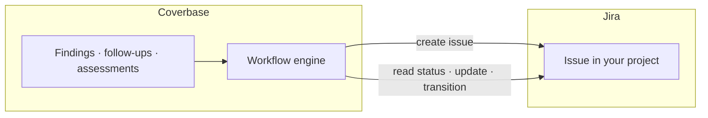

import AgentDirective from "/snippets/agent-directive.mdx";

<AgentDirective />

Coverbase creates and tracks issues in your Jira directly. Remediation work discovered during vendor risk reviews — a finding to chase, an internal control to fix, a follow-up to schedule — lands in the backlog your teams already triage, instead of living only inside the risk platform.

## What it does

- **Create Jira ticket is a native workflow action.** Any [workflow](/integrations/workflow-engine) can create a Jira issue at the right moment — when a finding is confirmed, when an assessment completes with open issues, when a follow-up goes unanswered — with the summary, description, project, and issue type built from the triggering object's fields.
- **On-demand creation from the platform**, for cases a person spots rather than a workflow.
- **Round-trip tracking.** Coverbase reads issue status, applies updates, and drives transitions through your project's own workflow scheme — it never invents states.

## Authentication and provisioning

The connector authenticates to Jira Cloud with an account email and API token (standard Atlassian token auth), stored per-organization in Coverbase's secrets manager and configured self-serve on the **Configuration → External integrations** page. Scope it to a service account with access to the target projects.

## Onboarding checklist

1. A Jira service account with create/edit permission in the target projects, and its API token.
2. The project keys and issue types Coverbase should create into.
3. The workflow moments that should raise tickets — configured in the [workflow engine](/integrations/workflow-engine), changeable by your team at any time.

<Info>
  Prefer events over tickets? Jira can also consume Coverbase [webhooks](/integrations/webhooks) through Atlassian automation if you want full control of issue creation on your side.
</Info>
