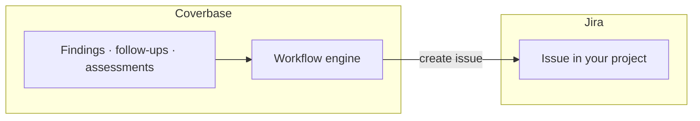

import AgentDirective from "/snippets/agent-directive.mdx";

<AgentDirective />

Coverbase creates issues in your Jira directly. Remediation work discovered during vendor risk reviews (a finding to chase, an internal control to fix, a follow-up to schedule) lands in the backlog your teams already triage, instead of living only inside the risk platform.

## What it does

- **Create jira ticket is a native workflow action.** Any [workflow](/integrations/workflow-engine) can create a Jira issue at the right moment (when a finding is confirmed, when an assessment completes with open issues, when a follow-up goes unanswered). You set the project key, the summary and the description, which can insert variables from the triggering object, and optionally an assignee. Issues are created with the **Task** issue type.
- **A test ticket from the configuration dialog.** **Create test ticket** on the Jira card raises a simple issue in a project you name, so you can confirm the connection before a workflow depends on it.
- **One-way.** Coverbase creates the issue and records it on the workflow run. It does not read the issue's status back or move it through your Jira workflow.

## Authentication and provisioning

The connector authenticates to Jira Cloud with an account email and API token (standard Atlassian token auth), stored per-organization in Coverbase's secrets manager and configured self-serve on the **Configuration → External Integrations** page: open the **JIRA** card and enter the **JIRA URL**, **Account identifier** and **API token**, then **Save JIRA Configuration**. Scope it to a service account with access to the target projects.

## Onboarding checklist

1. A Jira service account with create/edit permission in the target projects, and its API token.
2. The project keys Coverbase should create into. Each project needs the **Task** issue type.
3. The workflow moments that should raise tickets, configured in the [workflow engine](/integrations/workflow-engine) and changeable by your team at any time.

<Info>
  Prefer events over tickets? Jira can also consume Coverbase [webhooks](/integrations/webhooks) through Atlassian automation if you want full control of issue creation on your side.
</Info>
