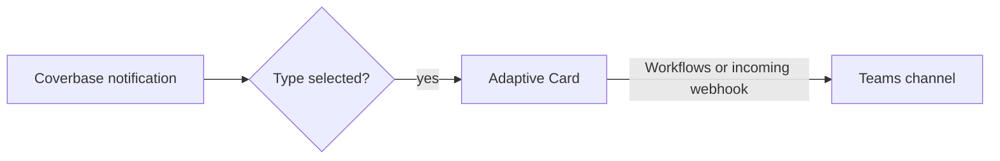

import AgentDirective from "/snippets/agent-directive.mdx";
import BetaConnector from "/snippets/beta-connector.mdx";

<AgentDirective />

<BetaConnector />

The Microsoft Teams connector is part of the [Integration Hub](/products/integration-hub). It posts the notification types you choose to one Teams channel, so a team sees new reviews, decisions and alerts where it already talks.

## What it does

- **One post per event.** A Coverbase notification can go to several people. The channel gets it once, however many recipients it had.
- **An Adaptive Card.** Each post carries the notification's title, its text (shortened past 2,000 characters) and, when the notification links somewhere, a button that opens the record in Coverbase.
- **Never in the way.** If Teams is unreachable or rejects a post, the notification still reaches its recipients in Coverbase and by email.

<Note>
  The cards are informational. Approving or declining from Teams (sign-offs, acceptance chain decisions, exit evidence) needs a Teams bot, which is not available yet. Each card's button opens the record in Coverbase, where the decision is made.
</Note>

## Authentication

The connector posts to a webhook URL that you create in Teams. The URL is itself the credential: anyone who holds it can post to the channel. Coverbase stores it in a secrets manager and only ever shows its host.

1. In the Teams channel, create a **Workflows** webhook (the "Post to a channel when a webhook request is received" template), or a legacy incoming webhook connector.
2. Copy the URL. Coverbase accepts HTTPS URLs on `webhook.office.com`, `logic.azure.com` and `environment.api.powerplatform.com` hosts only.

## Set up in Coverbase

1. Open **Configuration → External Integrations** and click **Microsoft Teams**.
2. On **Authentication**, paste the **Webhook URL**.
3. Under **Notification Types**, choose which notifications post. Each one posts once to the channel, whoever it was for.
4. Click **Save**, then **Send test message** and check the channel.

To post to a different channel, replace the webhook URL. To stop posting, **Pause** or **Disconnect** the connection.

## Related

<CardGroup cols={2}>
  <Card title="Email and notifications" icon="envelope" href="/user-guides/email-notifications">
    The notifications you can choose from.
  </Card>
  <Card title="Slack" icon="slack" href="/integrations/guides/slack">
    The Slack app.
  </Card>
  <Card title="Integration Hub guide" icon="book-open" href="/user-guides/integration-hub">
    Connecting and pausing a connection.
  </Card>
  <Card title="Webhooks" icon="arrow-right-from-bracket" href="/integrations/webhooks">
    Sending structured events to your own systems instead.
  </Card>
</CardGroup>
