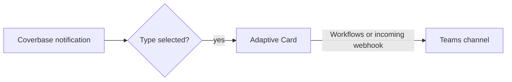

import AgentDirective from "/snippets/agent-directive.mdx";
import BetaConnector from "/snippets/beta-connector.mdx";

<AgentDirective />

<BetaConnector />

The Microsoft Teams connector is part of the [Integration Hub](/products/integration-hub). It posts the notification types you choose to one Teams channel, so a team sees new reviews, decisions and alerts where it already talks.

## What it does

- **One post per event.** A Coverbase notification can go to several people. The channel gets it once, however many recipients it had.
- **An Adaptive Card.** Each post carries the notification's title, its text (shortened past 2,000 characters) and, when the notification links somewhere, a button that opens the record in Coverbase.
- **Never in the way.** If Teams is unreachable or rejects a post, the notification still reaches its recipients in Coverbase and by email.

With a Coverbase bot registered in your Azure tenant, three kinds of card also carry **Approve** and **Decline** buttons: a Front Door disposition waiting on a sign-off group, a finding's acceptance chain waiting on a recommendation, decision or approval, and exit plan evidence waiting on its approver. The same bot lets people request a vendor by chatting with it (see the [Intake Agent](/user-guides/intake-agent)).

## Authentication

The connector posts to a webhook URL that you create in Teams. The URL is itself the credential: anyone who holds it can post to the channel. Coverbase stores it in a secrets manager and only ever shows its host.

1. In the Teams channel, create a **Workflows** webhook (the "Post to a channel when a webhook request is received" template), or a legacy incoming webhook connector.
2. Copy the URL. Coverbase accepts HTTPS URLs on `webhook.office.com`, `logic.azure.com` and `environment.api.powerplatform.com` hosts only.

## Set up in Coverbase

1. Open **Configuration → External Integrations** and click **Microsoft Teams**.
2. On **Authentication**, paste the **Webhook URL**.
3. Under **Notification Types**, choose which notifications post. Each one posts once to the channel, whoever it was for.
4. Click **Save**, then **Send test message** and check the channel.

To post to a different channel, replace the webhook URL. To stop posting, **Pause** or **Disconnect** the connection.

## Register the bot

Approvals and Teams intake need a bot registered in your own Azure tenant. The incoming webhook above keeps working without it.

1. In the Azure portal, create an **Azure Bot** resource. For the type of app choose **Single Tenant**, and let Azure create a new Microsoft App ID.
2. Open the bot's **Configuration** and copy the **Microsoft App ID** and the **App Tenant ID**. Under **Manage Password**, create a client secret and copy its value.
3. In Coverbase, open the Microsoft Teams connection's **Authentication** tab. Enter the **Bot app ID**, **Bot client secret** and **Directory (tenant) ID**, turn on **Approve and decline from Teams cards**, and save. Copy the **Messaging Endpoint** it shows.
4. Back in Azure, paste it into the bot's **Messaging endpoint** and save.
5. Under **Channels**, add **Microsoft Teams** and accept the terms.
6. Build a Teams app package for the bot in the Developer Portal for Teams: a new app with a **Bot** feature using the app ID, in the **Team** and **Personal** scopes. Have a Teams admin upload it to your organization's app catalog.
7. Add the app to the team, then to the channel that should receive approval cards. The connection's **Approval Cards** status reads **Posting to** that team and channel once Teams tells the bot it was added.
8. In the Microsoft Teams connection's **Notification Types**, choose the approval notifications to post.

The **Approval Cards** status is **Live**, **Needs the bot** (approvals on but no app ID and secret, so cards post without buttons), **Needs a channel**, or **Off**.

## Deciding from a card

- **You act as yourself.** The first time someone presses a button, Coverbase looks them up in Microsoft's roster for the conversation and matches the address to an active member of your organization. They then decide with their own Coverbase permissions, so a person who cannot decide in the dashboard cannot decide in Teams. Nothing on the card identifies anyone.
- **A press counts once.** If Teams delivers a press twice, it is recorded once. A press on a card someone already decided reports it as decided.
- **A card is tied to what it showed.** If the disposition was revised or the acceptance chain moved on after the card was posted, the press is refused rather than applied to a decision the presser never saw.
- **Decline needs a reason.** Declining a sign-off records the reason on the Front Door audit trail and leaves the disposition unsigned. Declining an acceptance step records remediation or rejection. Returning exit evidence reopens the step for its owner.
- **An outage never loses a notification.** If approvals are off, the bot is not in a channel, or a post fails, the plain card goes out instead.

The **Approvals** tab lists every **Approve** and **Decline** pressed: the time, the person, the request, the outcome (**Recorded**, **Already decided**, **Not allowed**, **Account not matched**, **Not recorded** or **Failed**) and the detail.

Coverbase checks that every message to the bot is signed by Microsoft for your bot, with your app ID, and from your tenant when you gave one. It sends the bot's token only to Microsoft's Bot Connector hosts.

## Related

<CardGroup cols={2}>
  <Card title="Email and notifications" icon="envelope" href="/user-guides/email-notifications">
    The notifications you can choose from.
  </Card>
  <Card title="Slack" icon="slack" href="/integrations/guides/slack">
    The Slack app.
  </Card>
  <Card title="Integration Hub guide" icon="book-open" href="/user-guides/integration-hub">
    Connecting and pausing a connection.
  </Card>
  <Card title="Webhooks" icon="arrow-right-from-bracket" href="/integrations/webhooks">
    Sending structured events to your own systems instead.
  </Card>
</CardGroup>
