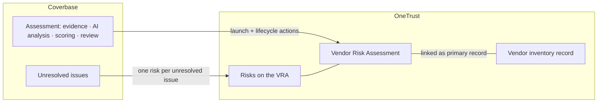
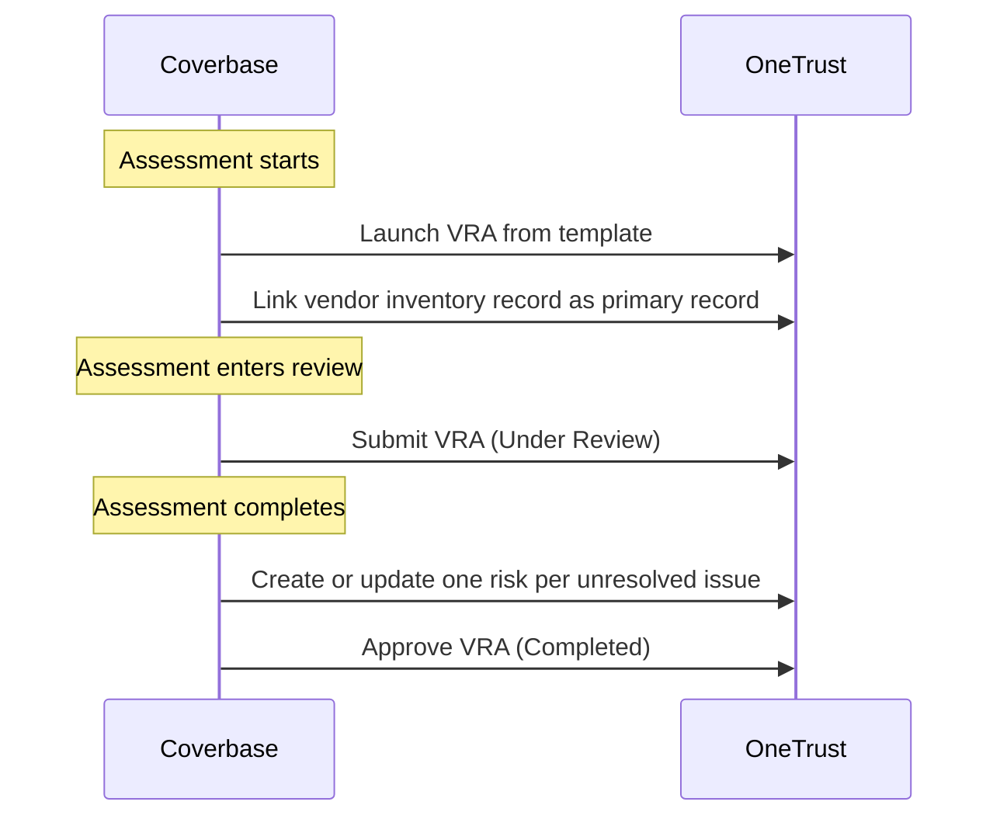

import AgentDirective from "/snippets/agent-directive.mdx";

<AgentDirective />

Coverbase integrates with **OneTrust Third-Party Risk Management** in production today. Assessments run in Coverbase; each one is mirrored as a OneTrust **Vendor Risk Assessment (VRA)** — launched when the Coverbase assessment starts, advanced through OneTrust's native lifecycle as work progresses, and, on completion, populated with one OneTrust risk per unresolved issue before being closed out. OneTrust stays the system of record; its risk register, treatment workflows, and reporting operate on the results natively.

## Lifecycle mirroring

OneTrust drives assessment stage through lifecycle *actions*, not a status field — and the integration speaks that language:

| Coverbase state | OneTrust action | Resulting VRA stage |
| --- | --- | --- |
| Assessment starts | Launch VRA from your template; link it to the vendor's inventory record as the primary record | In Progress |
| Assessment enters review | Submit the VRA | Under Review |
| Assessment completes | Create risks, then approve the VRA | Completed |

The vendor link uses OneTrust's primary-record mechanism, which persists through VRA completion — verified live against a customer sandbox, including the failure modes of the alternative linking approaches OneTrust silently accepts but later drops.

## Risk creation

On completion, each Coverbase issue that remains unresolved becomes a OneTrust risk attached to the VRA (mitigated issues stay in Coverbase; only exception-worthy risks are pushed):

| Coverbase | OneTrust risk field |
| --- | --- |
| Control identifier | Risk name |
| Issue title | Risk reason |
| Analyst's evidence-backed analysis | Risk description |
| Severity | Inherent risk level (expressed as OneTrust probability × impact heatmap factors) |
| Inverted, rescaled assessment score | Target risk level |
| Treatment notes and configured custom fields | OneTrust risk attributes |
| Risk owner assignments from the vendor record | OneTrust risk attributes |

The score translation is direction-aware: Coverbase scores run higher-is-better, OneTrust's heatmap runs higher-is-worse, so scores are inverted and rescaled onto your OneTrust matrix — pinned by tests across multiple scoring-scale shapes so a scale change never silently misbands a risk.

## Trigger model

The completion push runs as a background job rather than inside a user request: at real portfolio scale (an assessment can carry dozens of risks), per-risk creates plus retry pacing exceed any sensible request timeout, and a half-done batch is exactly the failure mode the design eliminates.

## Reliability

- **Create-or-update, keyed on OneTrust IDs.** The VRA ID and each risk's OneTrust ID are persisted on the Coverbase side the moment they're created. A re-run updates existing records in place with the latest data — replays never duplicate.
- **Write-contention pacing.** Risks on a VRA contend on the linked vendor inventory record inside OneTrust; the connector paces successive creates and retries OneTrust's conflict responses, which are duplicate-safe by construction.
- **Field semantics verified live.** OneTrust's native risk fields full-replace on update while custom attributes merge, and several schema-advertised fields silently discard writes. The connector's write shapes were confirmed field-by-field against a live tenant — including re-sending the native field set on every update so nothing is silently cleared.
- **Partial pushes are reported, never silent.** A single risk failure is isolated so it doesn't block close-out, and the sync logs a tally of synced versus failed risks with their identifiers.
- **Sandbox-verified rollout.** The integration was stood up and verified end to end (launch → submit → risks → approve → read-back) against the customer's OneTrust sandbox before touching production.

## Authentication and provisioning

The connector authenticates with an org-scoped OneTrust bearer token carrying assessment and risk-module scope, stored in Coverbase's secrets manager.

## In production

<Card title="State workers'-compensation insurance fund" icon="building-shield">
  Runs vendor reassessments in Coverbase against its OneTrust-resident vendor inventory: every Coverbase assessment appears as a OneTrust VRA linked to the right vendor record, moves through OneTrust's stages as analysts work, and lands its unresolved issues as OneTrust risks — sized to a real book of risks per assessment — with the fund's own custom risk attributes populated.
</Card>

## Onboarding checklist

1. A OneTrust API token with assessment and risk-module scope (sandbox first).
2. A VRA template for Coverbase-driven assessments (Coverbase provides the required shape; your OneTrust admin creates it).
3. Your risk heatmap dimensions and any custom risk attributes to populate, with their option lists.
4. Vendor inventory identifiers on the Coverbase vendor records (loaded during onboarding through the [Import API](/import-api)).
