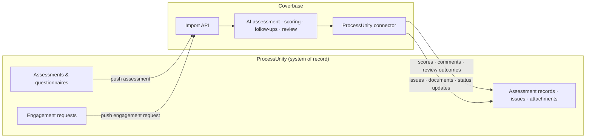
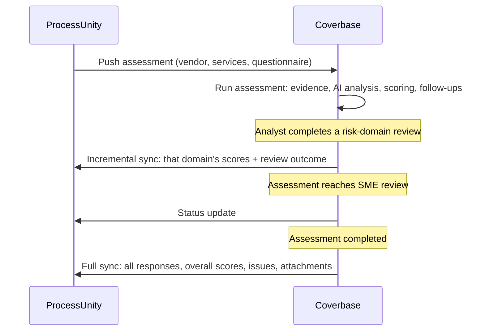

import AgentDirective from "/snippets/agent-directive.mdx";

<AgentDirective />

Coverbase runs bidirectional integrations with ProcessUnity in production today, at enterprise scale. ProcessUnity stays the system of record; Coverbase does the assessment work - AI-assisted questionnaire analysis, evidence collection, follow-ups, scoring, and review - and writes everything back as native ProcessUnity records, so your existing ProcessUnity reporting, dashboards, and downstream workflows keep working unchanged.

## What flows in

ProcessUnity pushes records into org-scoped Coverbase import endpoints as JSON. Two inbound flows are in production:

**Assessments.** ProcessUnity pushes a due-diligence or passive assessment covering one or more vendor services. Coverbase upserts the vendor and services (keyed on ProcessUnity's own IDs), creates the assessment with every covered service attached, records the inherent-risk questionnaire answers, and - for document-first assessment types - invites the vendor into the Coverbase portal to upload evidence. Multi-service assessments arrive as one record per service and are reconciled into a single assessment with strict consistency checks on the vendor and assessment identifiers.

**Engagement requests.** ProcessUnity pushes a new engagement (vendor, service, prior pre-screening answers, and attached files, which Coverbase fetches from ProcessUnity's AttachedFiles API). Coverbase creates an intake session, autofills the risk-evaluation questionnaire from the pushed answers and documents using AI, assigns it to the named analyst, and notifies them that a draft is ready for review. The analyst reviews, edits, and submits - the submission is exported back to the ProcessUnity engagement request automatically.

## What flows back

Coverbase writes results to ProcessUnity through its import-template API, as native records:

| Coverbase | ProcessUnity destination |
| --- | --- |
| Per-question scores, analyst comments, and follow-up history | Questionnaire response records (row-level upsert keyed on ProcessUnity's response ID) |
| Review outcomes per risk domain (status, reviewer, completion date, comments) | Assessment record fields |
| Whole-assessment scoring metrics (total, maximum, percentage, residual risk rating) | Assessment record fields |
| Findings requiring remediation | ProcessUnity issue records, with owner, impact, remediation date, and links back to the source question |
| Vendor-provided documents from follow-ups | Assessment attachments |
| Assessment status transitions (for example, entering SME review, completion) | Assessment status field |
| Submitted intake answers and their AI summary | Engagement request fields |

Every record carries a link back to the Coverbase assessment, so a ProcessUnity reviewer is one click from the full evidence trail.

## Trigger model

Syncs fire on the moments your process already has, not on a polling schedule:

The per-domain incremental sync means ProcessUnity reflects progress as each review lane (for example, security, compliance) finishes - not only at the end. The full sync on completion re-upserts everything and acts as the final reconciliation.

## Reliability

- **Positional field ordering, enforced.** ProcessUnity imports process fields by position, not name. The connector enforces the exact template field order on every record and holds empty positions explicitly - the most common source of silent data corruption in hand-built ProcessUnity integrations, eliminated structurally.
- **Idempotent by key.** Questionnaire-response pushes are row-level upserts keyed on ProcessUnity's response IDs; inbound replays match on ProcessUnity's assessment and vendor IDs. Re-deliveries and re-runs update in place.
- **Field limits handled.** ProcessUnity caps comment fields at 4,000 characters and truncates silently. Coverbase truncates proactively and appends the assessment link so reviewers can always reach the full content.
- **Full inbound audit trail.** Every payload ProcessUnity pushes is preserved with its request ID, byte count, and outcome, so any delivery question is answerable from the record rather than reconstructed from logs.
- **Best-effort outbound.** A ProcessUnity outage never blocks an analyst from completing a review; the completion-time full sync reconciles anything a transient failure missed.
- **User identity resolution.** Reviewers are identified to ProcessUnity by their ProcessUnity user ID, resolved by email against your tenant's own user report and cached - never by free-text names.

## Authentication and provisioning

The connector authenticates to your ProcessUnity tenant with OAuth2 client credentials, stored per-organization in Coverbase's secrets manager (never in configuration or code). Sandbox and production tenants are configured independently, and Coverbase teams routinely stand the integration up against the sandbox tenant first.

## In production

<CardGroup cols={2}>
  <Card title="Large digital-asset financial platform" icon="building-columns">
    Bidirectional at scale: ProcessUnity pushes due-diligence and passive assessments (including multi-service vendors); Coverbase runs AI-driven analysis and vendor outreach, then syncs scores, domain reviews, issues, and attachments back - incrementally per risk domain and fully at completion.
  </Card>
  <Card title="Top-20 US bank" icon="landmark">
    Engagement requests flow from ProcessUnity into AI-autofilled intake drafts for analyst review; assessment starts select the matching Coverbase assessment plan from fourteen ProcessUnity assessment types; results and status updates flow back per type, so parallel assessments of different types never collide on the shared record.
  </Card>
</CardGroup>

## Onboarding checklist

What the integration needs from your team, typically stood up sandbox-first in a few weeks:

1. ProcessUnity API credentials (OAuth2 client) for sandbox and production tenants.
2. The import templates in your tenant that Coverbase will write to (your ProcessUnity admin creates these from Coverbase-provided field lists; their tenant-specific IDs are configured during onboarding).
3. Your assessment-type vocabulary, mapped to Coverbase assessment plans.
4. A user report or directory export so reviewer identities resolve to your ProcessUnity user IDs.

<Info>
  For the generic inbound surface these flows build on, see the [Import API](/import-api). For what to expect during delivery, see [onboarding](/integrations/onboarding).
</Info>
