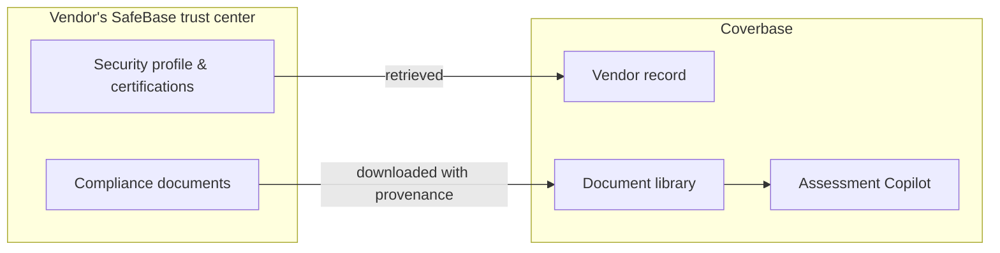

import AgentDirective from "/snippets/agent-directive.mdx";

<AgentDirective />

Many vendors already publish their security posture through a **SafeBase** trust center - certifications, SOC 2 reports, policies, subprocessor lists. Coverbase pulls that published evidence automatically, so an assessment starts from what the vendor has already disclosed instead of opening with an email asking for it.

## What it does

- **Trust-center profile retrieval.** A vendor's SafeBase profile - products, posture data, published certifications - enriches the Coverbase vendor record automatically.
- **Document collection.** Compliance documents the vendor publishes are downloaded into the document library with their SafeBase provenance recorded, ready for [Assessment Copilot](/products/assessment-copilot) to analyze as evidence.
- **Less vendor friction.** Evidence the vendor already maintains in one place isn't re-requested over email - outreach is reserved for what the trust center doesn't answer.

## Authentication and provisioning

SafeBase retrieval runs against the vendor's published trust center using SafeBase's API, with request signing handled by the connector. Gated trust centers that require an access grant follow the vendor's own approval flow.

## Onboarding checklist

Nothing to install - SafeBase retrieval participates in Coverbase's standard vendor enrichment and document collection. Where a vendor's trust center is access-gated, your team (or Coverbase, during an assessment) requests access through SafeBase as usual.
