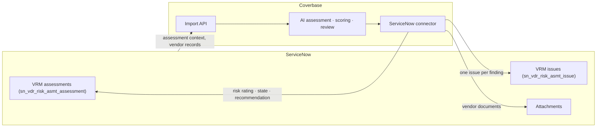
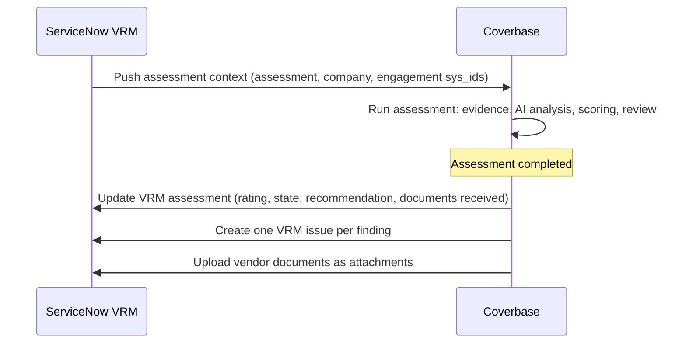

import AgentDirective from "/snippets/agent-directive.mdx";

<AgentDirective />

Coverbase integrates with ServiceNow's **Vendor Risk Management (VRM)** application natively and runs it in production today. Coverbase does the assessment work; results land in the same VRM tables your ServiceNow reporting, SLAs, and downstream workflows already consume — not in a side table or a file drop.

## What flows

**Into ServiceNow, on assessment completion:**

| Coverbase | ServiceNow VRM destination |
| --- | --- |
| Assessment outcome and risk rating | VRM assessment record (rating, state) |
| Assessment summary and recommendation | VRM assessment record fields |
| Assessor and business owner | VRM assessment record references (by `sys_id`) |
| Document types received during the assessment | VRM assessment record |
| Each finding | A VRM issue record — level, rating, type, assignee, business owner, linked to the assessment, vendor, and engagement |
| Vendor-provided documents | Native attachments on the VRM assessment record |

**Out of ServiceNow:** assessment context — the VRM assessment, company, and engagement identifiers, assessor and business-owner references — arrives with the inbound push and is held on the Coverbase assessment, so every outbound write addresses the exact ServiceNow records it belongs to.

## Trigger model

## Reliability

- **Addressed by `sys_id`, never by name.** Every write targets ServiceNow records by their `sys_id` references captured at import time, so renames in either system never mis-route an update.
- **Validated identifiers.** Table names and `sys_id` values are validated against strict patterns before any request is constructed — no injection surface, no malformed writes.
- **Attachment limits respected.** ServiceNow's instance attachment size limit is enforced client-side before upload; oversized documents are reported rather than failed mid-transfer.
- **Best-effort completion sync.** A ServiceNow outage never blocks an analyst from completing an assessment; failed pushes are logged with the exact record identifiers for replay.

## Authentication and provisioning

The connector authenticates with a dedicated ServiceNow integration user (Basic Auth over HTTPS), stored per-organization in Coverbase's secrets manager. The integration user needs write access to the VRM assessment and issue tables and the attachment API — a scoped role your ServiceNow admin controls.

## In production

<Card title="Major identity provider" icon="fingerprint">
  Runs its third-party risk program in Coverbase with ServiceNow VRM as the downstream system of record: completed assessments update the VRM assessment record, every finding lands as a VRM issue routed to the right business owner, and vendor evidence documents attach directly to the ServiceNow record — no swivel-chair re-entry between the two systems.
</Card>

## Onboarding checklist

1. A ServiceNow integration user with write access to the VRM assessment and issue tables and the attachment API, for your sub-production instance first.
2. The VRM field choices your process uses (issue types, ratings, states), so Coverbase maps outcomes onto your configured values.
3. The inbound push from ServiceNow (or an initial bulk load through the [Import API](/import-api)) carrying the assessment and vendor `sys_id` references.

<Info>
  ServiceNow can also receive Coverbase [webhooks](/integrations/webhooks) for real-time eventing outside VRM — for example, driving ITSM tickets from assessment lifecycle events. See [end-to-end workflows](/integrations/end-to-end-workflows).
</Info>
