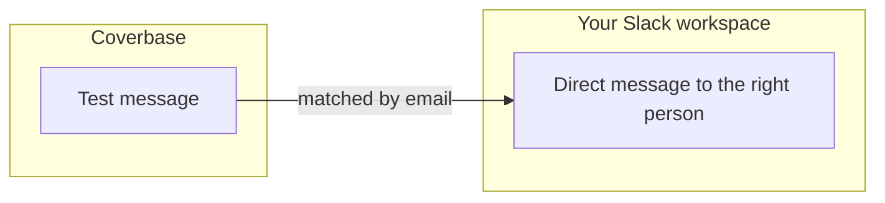

import AgentDirective from "/snippets/agent-directive.mdx";

<AgentDirective />

Coverbase ships a Slack app that installs into your workspace through Slack's own authorization flow. Once connected, Coverbase can reach people in your workspace by direct message, matched to their Slack account by email.

<Note>
  Coverbase notifications (assignments, reviews, alerts) are delivered in the app and by email, not through the Slack app. The only message the Slack app sends today is the test message below. To get Coverbase events into Slack now, use [webhooks](#channel-based-patterns).
</Note>

## What it does

- **Installed by you, scoped by Slack.** An admin connects the app from the **Slack** card on the **Configuration → External Integrations** page with **Connect to Slack**. Slack's standard OAuth flow runs, so no credentials are entered in Coverbase and your workspace admins see and control exactly what the app can do.
- **Direct messages to the right person.** Coverbase resolves a recipient to their Slack identity by email. **Send test message** sends a message to the Slack account matching your own signed-in email, so you can confirm the match before relying on it.
- **Test, reauthorize, disconnect.** **Test connection** asks Slack to confirm the workspace, **Reauthorize Slack** repeats the authorization, and **Disconnect** removes the saved connection.
- **Rate-limit aware.** The connector honors Slack's retry-after signals and distinguishes transient failures from authorization problems.

## Channel-based patterns

For channel notifications and richer routing (a #vendor-risk feed, per-team channels), pair Coverbase [webhooks](/integrations/webhooks) with a Slack workflow or a small handler you control. The webhook carries the event type and affected object, so the routing logic stays yours.

## Onboarding checklist

1. A workspace admin connects the Coverbase Slack app (OAuth, self-serve).
2. Confirm user emails match between Coverbase and Slack: that's the identity join. **Send test message** checks it for you.
3. For notifications in Slack today, register a webhook and route its events into the channels you choose.
