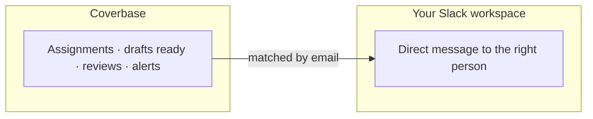

import AgentDirective from "/snippets/agent-directive.mdx";

<AgentDirective />

Coverbase ships a Slack app that installs into your workspace and delivers notifications where your team already works: an analyst learns an intake draft is ready, a reviewer learns an assessment reached their queue, an owner learns a finding was assigned - as a Slack message, not another unread email.

## What it does

- **Direct messages to the right person.** Coverbase resolves the notification's recipient to their Slack identity by email, so messages reach the individual who owns the work.
- **Installed by you, scoped by Slack.** The app installs through Slack's standard OAuth flow from the **Configuration → External integrations** page; your workspace admins see and control exactly what it can do.
- **Rate-limit aware.** The connector honors Slack's retry-after signals and distinguishes transient failures from authorization problems, so a burst of activity degrades gracefully instead of dropping messages.

## Channel-based patterns

For channel notifications and richer routing (a #vendor-risk feed, per-team channels), pair the Slack app with Coverbase [webhooks](/integrations/webhooks) and a Slack workflow or a small handler you control - the webhook carries the event type and affected object, so the routing logic stays yours.

## Onboarding checklist

1. A workspace admin installs the Coverbase Slack app (OAuth, self-serve).
2. Confirm user emails match between Coverbase and Slack - that's the identity join.
3. Choose which notification types deliver to Slack in your notification settings.
