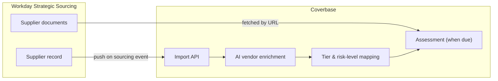
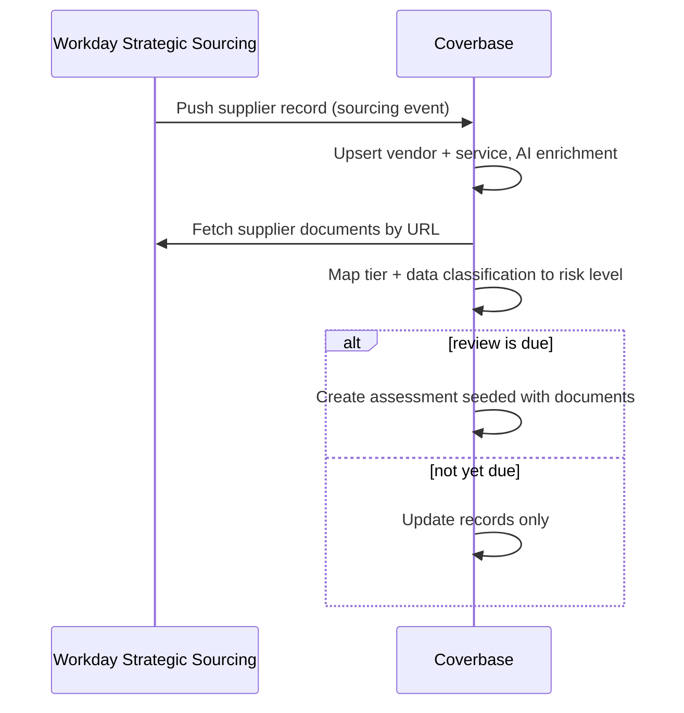

import AgentDirective from "/snippets/agent-directive.mdx";

<AgentDirective />

Coverbase integrates with **Workday Strategic Sourcing (WSS)** in production today. The sourcing event is the trigger: when procurement advances a supplier in WSS, the supplier record flows into Coverbase, which enriches the vendor with AI, ingests the supplier's uploaded documents, maps procurement's classification onto your risk tiers, and - when a review is due - launches the assessment automatically. Security review keeps pace with procurement without anyone re-keying data.

## What flows

WSS pushes a supplier record into an org-scoped Coverbase import endpoint. From one push, Coverbase:

1. **Upserts the vendor and service**, keyed on WSS identifiers - replays update, never duplicate.
2. **Enriches the vendor with AI** - company profile, description, and risk-relevant context are filled automatically rather than left blank for an analyst.
3. **Fetches the supplier's documents** from the URLs in the WSS record (security questionnaires, certifications, contracts) and stores them on the vendor with their WSS provenance recorded.
4. **Maps procurement's classification to your risk model** - WSS tier, data-classification, and volume answers translate to Coverbase custom fields and the vendor's risk level on your scale.
5. **Creates the assessment when one is due**, seeded with the fetched documents as supporting evidence, so the AI analysis starts from what procurement already collected. Pushes for suppliers not yet due for review update the record without launching redundant work.
6. **Activates the vendor and service** so they appear in your live portfolio immediately.

## Trigger model

## Reliability

- **Idempotent on WSS identifiers.** Re-pushed suppliers refresh the existing vendor and service; assessment creation is gated on review cadence, so procurement re-syncs never spawn duplicate assessments.
- **Validated before writes.** Malformed records are rejected with a field-level message and leave nothing behind.
- **Document provenance preserved.** Every document fetched from WSS is stored with its source recorded, so evidence in an assessment is always traceable to the procurement event that supplied it.
- **Graceful partial data.** A supplier record missing optional fields (documents, classification answers) still lands; the mapping fills what it has and leaves the rest to enrichment or the analyst.

## Authentication and provisioning

WSS pushes authenticate with an org-scoped Coverbase service-account API key, provisioned during onboarding and manageable through the [API keys](/api-reference/api-keys) surface. Document fetches use the URLs carried in the WSS record.

## In production

<Card title="Global search & observability company" icon="magnifying-glass-chart">
  Runs procurement-driven vendor security review: every supplier advancing through Workday Strategic Sourcing lands in Coverbase already enriched, classified onto the company's vendor tiers, and - when due - under assessment with the supplier's own uploaded evidence attached. Incoming vendors and services activate immediately, so the security team's portfolio always matches procurement's reality.
</Card>

## Onboarding checklist

1. A Coverbase service-account API key for the WSS push (provisioned during onboarding).
2. The WSS webhook or workflow step that pushes the supplier record at your chosen sourcing stage.
3. Your tier and data-classification vocabulary in WSS, mapped once to Coverbase risk levels and custom fields.
4. Assessment cadence rules - which tiers get assessed, and how often.
