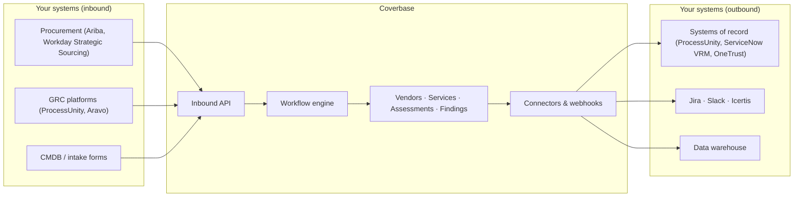

import AgentDirective from "/snippets/agent-directive.mdx";

<AgentDirective />

This page describes how Coverbase integrates with the systems your organization already runs and how those integrations behave end to end. It's intended for security, integration, and procurement teams evaluating Coverbase as part of a broader third-party risk and vendor lifecycle stack.

The integration model is built around three layers: inbound API calls that bring data and commands into Coverbase, a workflow engine that orchestrates the work, and outbound webhooks that notify your downstream systems as work progresses.

## Architecture

<CardGroup cols={3}>
  <Card title="Inbound" icon="arrow-right-to-bracket">
    External systems push data and commands into Coverbase. Procurement platforms create vendors, intake forms submit questionnaires, CMDBs sync service catalogs, and GRC tools start assessments. Each is a standard authenticated API call.
  </Card>

  <Card title="Orchestration" icon="diagram-project">
    Once data lands, the workflow engine takes over. Triggers fire on object events, schedules, or external invocation. Conditions branch the flow on risk score, tier, data class, jurisdiction, or contract value. Actions execute the work: send a questionnaire, request evidence, run Copilot, raise review gates in parallel, and wait for their outcomes.
  </Card>

  <Card title="Outbound" icon="arrow-right-from-bracket">
    As workflows progress, Coverbase fires webhooks to endpoints you control. Webhooks carry the event type and the affected object, so ServiceNow, Jira, Slack, Ariba, Icertis, or your data warehouse can react in real time.
  </Card>
</CardGroup>

For the platforms Coverbase integrates with natively - including bidirectional GRC deployments running in production today - see the [platform-specific guides](/integrations/guides/processunity), and [integration patterns](/integrations/patterns) for the four shapes those integrations compose.

<Info>
  **Orchestration is yours to configure and to change.** Workflows are built in a no-code designer in the **Workflows** section of the dashboard: pick a trigger, add conditions, add actions, activate. Coverbase will build the first set with you during onboarding, and they are handed over as ordinary editable definitions rather than as locked configuration. After that, both the definitions and every running instance are reachable through the dashboard and the API, so you can interrupt, modify, or replace any step at any time. See [Configuring your data model](/user-guides/data-model-configuration).
</Info>

## Public API surface

The public resource API covers these operations:

| Resource | Operations |
| -------- | ---------- |
| Vendor | Create, get, update (`POST`/`GET`/`PATCH /v1/vendors`) |
| Service | Create + update under a vendor (`POST`/`PATCH /v1/vendors/{id}/services`) |
| User | Provision (create-or-get), list / look up by email, get, update role / deprovision (`POST`/`GET`/`PATCH /v1/users`) |
| Assessment | Create, get (`POST`/`GET /v1/assessments`) |
| Finding | List, create, get, status-sync (`/v1/findings`) |
| Obligation | List, create, get, status-sync (`/v1/obligations`) |
| Workflow | Run, get run with steps (`POST /v1/workflows/{name}/run`, `GET /v1/workflows/runs/{id}`) |
| Custom field | Discover definitions, read and write values (`/v1/custom-fields`) |
| Webhook | Create, list, update, delete, test (`/v1/webhooks`) |

Bulk vendor/assessment loading is also available through the separate [Import API](/import-api). Control sets, statuses, tags, and scale levels are referenced **by ID** in these requests/responses; configure them in the dashboard.

<Info>
  The public API uses plural route names (`/v1/vendors`, `/v1/assessments`). Internal dashboard routes use singular nouns and are not part of the supported public surface.
</Info>

## Where to go next

<CardGroup cols={2}>
  <Card title="Integration patterns" icon="shapes" href="/integrations/patterns">
    The four shapes every integration composes: inbound push, outbound sync, webhooks, file-based import.
  </Card>

  <Card title="Platform-specific guides" icon="plug" href="/integrations/guides/processunity">
    How the ProcessUnity, ServiceNow, OneTrust, Workday Strategic Sourcing, and Aravo integrations work, with architecture diagrams.
  </Card>

  <Card title="Workflow engine" icon="gears" href="/integrations/workflow-engine">
    Triggers, conditions, and actions. How orchestration logic is composed.
  </Card>

  <Card title="Triggering workflows from external systems" icon="bolt" href="/integrations/triggering-workflows">
    Three patterns for starting work in Coverbase from outside the UI.
  </Card>

  <Card title="Webhooks" icon="arrow-right-from-bracket" href="/integrations/webhooks">
    Register endpoints, subscribe to event types, verify signatures, handle retries.
  </Card>

  <Card title="End-to-end workflows" icon="route" href="/integrations/end-to-end-workflows">
    Full lifecycle walkthroughs for onboarding, parallel review, monitoring, and offboarding.
  </Card>

  <Card title="Reviews, approvals and gates" icon="gavel" href="/user-guides/reviews-and-approvals">
    Gate outcomes, parallel domain-scoped SME reviews, multi-approver logic, and rework loops.
  </Card>
</CardGroup>
