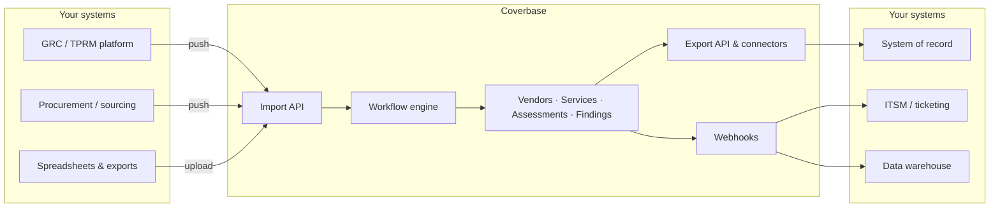

import AgentDirective from "/snippets/agent-directive.mdx";

<AgentDirective />

Every Coverbase integration — including the shipped [platform guides](/integrations/guides/processunity) — composes the same four shapes. This page names them so your integration or platform team can map your systems onto them before the first architecture call.

## 1. Inbound push

Your system of record stays in charge and pushes into Coverbase: a procurement platform creates the vendor, a GRC platform starts the assessment, an intake form submits a questionnaire. Each push is a standard authenticated API call to an org-scoped endpoint.

What makes inbound pushes production-safe:

- **External IDs are the contract.** Every pushed record carries your system's identifier. Coverbase stores it and keys all matching on it, so a replayed delivery updates the existing record instead of duplicating it.
- **Validation before writes.** Required identifiers are checked before anything is persisted; a rejected payload leaves nothing behind. Rejections return `422` (malformed or missing fields) or `409` (the payload conflicts with existing records) with a message naming the offending field.
- **Replays are safe.** Redelivering the same payload refreshes the record from the latest data and never dispatches duplicate work — no second assessment run, no duplicate intake session, no re-imported attachments.

Used by the [ProcessUnity](/integrations/guides/processunity), [Workday Strategic Sourcing](/integrations/guides/workday-strategic-sourcing), and [Aravo](/integrations/guides/aravo) integrations, and by the generic [Import API](/import-api).

## 2. Outbound sync

Coverbase pushes results back into the system your auditors and downstream teams already look at: assessment outcomes, scores, review decisions, findings, and documents land as native records in the external platform.

What makes outbound syncs production-safe:

- **Native records, not exports.** Results are written to the platform's own object model — a ProcessUnity assessment record, a ServiceNow Vendor Risk assessment, a OneTrust risk — so downstream reporting works unchanged.
- **Idempotent upserts.** Every outbound record is keyed on an external ID. Re-running a sync updates in place; it never duplicates.
- **Best-effort by design.** An external platform outage never blocks your analysts: syncs are logged and retried, and a failed push never fails the assessment or the user's action that triggered it.
- **Platform limits handled proactively.** Field length caps, rate limits, and write-contention retries are handled inside the connector, not left to your team to discover.

Used by the [ProcessUnity](/integrations/guides/processunity), [ServiceNow](/integrations/guides/servicenow), and [OneTrust](/integrations/guides/onetrust) integrations.

## 3. Webhooks and workflows

For systems that want to *react* rather than hold a mirrored copy, Coverbase fires [webhooks](/integrations/webhooks) as objects change and the [workflow engine](/integrations/workflow-engine) orchestrates multi-step processes. External systems can also [trigger workflows](/integrations/triggering-workflows) directly.

This is the lightest-weight shape: no field mapping, no connector — an endpoint you control receives signed events and decides what to do.

## 4. File-based import

For platforms without a usable API — or for one-time migrations — Coverbase imports structured files (Excel, CSV) through per-format import specifications that parse your questionnaire or vendor export into Coverbase's control and question model. The same external-ID matching applies, so a file import and a later API integration reconcile onto the same records.

Used for bulk vendor loads, historical assessment migration, and questionnaire imports during onboarding. See the [Import API](/import-api).

## Composing the shapes

Real deployments combine shapes. A typical GRC coexistence deployment uses **inbound push** (the GRC platform starts assessments), **outbound sync** (results land back on the GRC record), and **webhooks** (ticketing and chat notifications along the way) — see [end-to-end workflows](/integrations/end-to-end-workflows) for the full picture, and the [platform guides](/integrations/guides/processunity) for how each shipped integration composes them.
