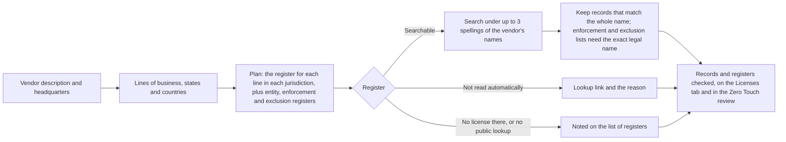

import AgentDirective from "/snippets/agent-directive.mdx";

<AgentDirective />

A vendor that collects debts, originates mortgages, adjusts claims or rewires a building usually needs a license from the state or country where it works. The license lives on the issuing regulator's own register, not on the vendor's website. Coverbase works out which licenses the vendor's business calls for, searches the registers that issue them, and shows you what each register says.

Sanctions and debarment lists are not part of the license lookup: the Zero Touch sanctions screen checks the vendor against them separately. Enforcement actions and exclusions the license lookup finds are shown first.

The most common mistake is reading an empty result as a clean one. A register that was not read, or that publishes no lookup, says nothing about the vendor. The page lists every register planned for the vendor and what happened at each one, so you can tell the two apart.

## Where it runs

<CardGroup cols={2}>
  <Card title="Vendor Intelligence" icon="magnifying-glass-chart">
    The **Licenses** tab of a vendor's [Vendor Intelligence](/products/vendor-intelligence) section. License records are gathered with the corporate registration research and refresh with it. Refreshing that research checks the registers again.
  </Card>
  <Card title="Zero Touch Assessments" icon="bolt">
    A [Zero Touch](/products/zero-touch-assessments) run that includes the **Licenses** section (on by default) waits for the vendor's license research, then grades the license controls from the same records the **Licenses** tab shows.
  </Card>
</CardGroup>

Research waits for a description of the vendor. Until the vendor has an industry or a description on file, nothing is stored, because registers chosen from nothing would read as "no license register applies".

## How a lookup runs

<Steps>
  <Step title="Classify the vendor's lines of business">
    A model reads the vendor's name, headquarters and description the way a reviewer would, and names every licensed line of business the vendor itself is in. It judges the vendor's own activity, never its customers': a consulting firm that serves banks is not a bank, and software, data, research and consulting need none of these licenses. When the description does not say what the vendor does, it chooses none and says the description is too thin. Its one sentence of reasoning is kept and shown when no register applies.
  </Step>
  <Step title="Work out where the vendor operates">
    The same read gives the US state of the headquarters, the US states the description confines the vendor to (a local practice, a regional bank, "licensed in Texas and Oklahoma"), whether it serves the US nationwide, and the countries outside the US where it is headquartered or operates. A US vendor that names no states is searched in every state, because licensed firms rarely list them.
  </Step>
  <Step title="Plan the registers">
    For each line of business, the plan takes the register that licenses it in each state and the national register for that line. It adds the business entity filing in the headquarters state, financial enforcement lists when a line is financial, Medicaid exclusion lists when a line is in health care, and the company registry and financial regulator of each country outside the US. Sanctions lists and SEC filing indexes are never planned, because they hold no license.
  </Step>
  <Step title="Search">
    Each register is searched by business name under up to three spellings of the vendor's names. A register gets 30 seconds, the whole lookup gets 150 seconds, and Coverbase sends at most three searches at a time to any one register's site.
  </Step>
  <Step title="Match records to the vendor">
    A register's search returns every firm that shares a word with the query. Only records that match the vendor's whole name are kept. See [How records are matched](#how-records-are-matched).
  </Step>
  <Step title="Report every register">
    Every planned register lands on the **State and National Registers** list with its outcome. A register that was not searched automatically carries a **Look up** link and the reason, so you can check it yourself.
  </Step>
</Steps>

## Supported lines of business

The classifier chooses from the lines below. A category applies in every country: an HVAC installer in Australia is a specialty contractor, and a recruiter in India is staffing or PEO.

<AccordionGroup>
  <Accordion title="Financial services">
    | Category | The vendor... |
    | --- | --- |
    | **Investment or securities** | Manages money, gives investment advice, or brokers or deals securities |
    | **Bank charter** | Is a chartered bank, trust company or credit union |
    | **Mortgage lender** | Originates or brokers residential mortgage loans |
    | **Mortgage servicer** | Services mortgage loans for others |
    | **Money transmitter** | Transmits money, sells payment instruments or stored value, or exchanges virtual currency for customers |
    | **Consumer lender** | Makes consumer, installment, payday or small loans |
    | **Debt collector** | Collects consumer or commercial debts owed to others |
    | **Debt buyer** | Buys charged-off debt and collects it |
    | **Check casher** | Cashes checks or offers deferred deposit |
    | **Sales finance** | Finances or buys retail installment contracts (auto or goods) |
  </Accordion>
  <Accordion title="Insurance, title and escrow">
    | Category | The vendor... |
    | --- | --- |
    | **Insurance carrier** | Underwrites insurance as an insurer or reinsurer |
    | **Insurance agency** | Sells, solicits or negotiates insurance as an agency or broker |
    | **Insurance adjuster** | Adjusts insurance claims as an independent or public adjuster |
    | **Title agent** | Is a title insurance agency |
    | **Title insurer** | Underwrites title insurance |
    | **Escrow agent** | Holds escrow for real estate or other transactions |
    | **Premium finance** | Finances insurance premiums |
    | **Third-party administrator** | Administers insurance or benefit plans for insurers or employers |
    | **Surplus lines broker** | Places surplus lines insurance |
  </Accordion>
  <Accordion title="Real estate and appraisal">
    | Category | The vendor... |
    | --- | --- |
    | **Real estate brokerage** | Brokers, lists or leases real estate for others |
    | **Appraisal management** | Is an appraisal management company |
    | **Appraisal firm** | Performs real estate appraisals itself |
    | **Auctioneer** | Auctions property |
    | **Property management** | Manages rental property for owners, including property preservation |
    | **Community association management** | Manages HOAs or community associations |
    | **Home inspection** | Performs home inspections |
    | **Foreclosure trustee** | Acts as trustee in non-judicial foreclosures |
  </Accordion>
  <Accordion title="Contractors and trades">
    | Category | The vendor... |
    | --- | --- |
    | **General contractor** | Builds, repairs or renovates commercial work |
    | **Residential contractor** | Builds, repairs or renovates residential work |
    | **Specialty contractor** | Performs trade work such as electrical, plumbing, HVAC or roofing |
    | **Lead and asbestos abatement** | Performs lead or asbestos abatement |
    | **Mold remediation** | Performs mold remediation |
    | **Pest control** | Performs pest control |
    | **Locksmith** | Performs locksmith work |
  </Accordion>
  <Accordion title="Professional services">
    | Category | The vendor... |
    | --- | --- |
    | **Public accounting** | Is a CPA firm offering audit, attest or tax services |
    | **Legal practice** | Is a law firm |
    | **Engineering firm** | Offers engineering services |
    | **Architecture firm** | Offers architecture services |
    | **Surveying firm** | Offers land surveying services |
    | **Private investigation** | Offers private investigation |
    | **Security guard services** | Offers security guard services |
    | **Process server** | Serves legal process |
    | **Alarm systems** | Installs or monitors alarm systems |
  </Accordion>
  <Accordion title="Health care">
    | Category | The vendor... |
    | --- | --- |
    | **Pharmacy** | Dispenses drugs |
    | **Drug wholesale distribution** | Distributes or warehouses drugs |
    | **Health facility** | Operates a licensed health facility |
    | **Healthcare provider** | Bills Medicaid or Medicare for care it provides |
  </Accordion>
  <Accordion title="Vehicles, commerce and government programs">
    | Category | The vendor... |
    | --- | --- |
    | **Motor vehicle dealer** | Sells vehicles |
    | **Vehicle title service** | Processes vehicle titles and registrations |
    | **Salvage vehicle auction** | Auctions salvage vehicles |
    | **Electronic lien and title** | Provides electronic lien and title services to lenders and DMVs |
    | **Waste hauler** | Hauls waste |
    | **Cannabis** | Operates in cannabis |
    | **Staffing or PEO** | Supplies staff or acts as a professional employer organization |
    | **Charitable solicitation** | Solicits charitable donations |
    | **Cloud service provider** | Sells cloud services to state governments |
    | **Diversity certification** | Says it is certified as minority, women or disadvantaged owned |
  </Accordion>
  <Accordion title="Telecom and energy">
    | Category | The vendor... |
    | --- | --- |
    | **Energy supplier** | Supplies retail energy |
    | **Telecom carrier** | Provides telecom service |
  </Accordion>
</AccordionGroup>

A category is chosen only for an activity the description states or the company's name plainly carries. The classifier never adds the lines a company of that kind usually has: a bank is **Bank charter**, plus mortgage lending or insurance only when the description names them.

<Note>
  Research stored before these lines existed may show a broader category, such as **Mortgage lending or money transmission**, **Insurance, title or escrow** or **Contracting or property services**. Each is searched as every line it covers.
</Note>

## The registers behind each line

Coverbase's register catalog was researched register by register: about 1,250 licensing, entity, enforcement, exclusion and certification registers across all 50 states, DC, Puerto Rico, Guam, the US Virgin Islands, federal agencies, international bodies and 17 other countries. About 600 of them are searched automatically. Every other one still appears on the vendor's list of registers with a link to its lookup.

A few examples from each family:

| Family | Example registers |
| --- | --- |
| Financial services | NMLS, the national register for state mortgage, money transmitter, consumer finance and debt licenses; state banking and financial regulators such as the New York Department of Financial Services, the California Department of Financial Protection and Innovation and the Texas Department of Banking; FDIC BankFind; the SEC's Investment Adviser Public Disclosure and broker-dealer list |
| Insurance, title and escrow | State insurance departments such as the California and Texas Departments of Insurance; the NAIC State Based Systems license lookup |
| Real estate and appraisal | The Appraisal Subcommittee's national registry of appraisal management companies; state real estate and appraiser boards such as the Texas Real Estate Commission; the Florida Department of Business and Professional Regulation |
| Contractors and trades | State contractor boards such as the California Contractors State License Board, the Washington Department of Labor and Industries and the Texas Department of Licensing and Regulation |
| Professional services | NASBA CPAverify for CPA firms; state engineering, architecture and surveying boards such as the Texas Board of Professional Engineers and Land Surveyors; the New York Office of the Professions; California's Bureau of Security and Investigative Services |
| Health care | State boards of pharmacy such as the Texas State Board of Pharmacy; state health facility registers such as the New York Department of Health; CMS laboratory and home health records |
| Vehicles | State DMV dealer lists such as the Texas Department of Motor Vehicles; state electronic lien and title provider lists |
| Commerce and government programs | FMCSA operating authority for waste haulers; the California Department of Cannabis Control; the IRS list of certified PEOs; state charity registries such as the California Attorney General's Registry of Charities and Fundraisers; FedRAMP, GovRAMP and TX-RAMP for cloud providers; SBA certifications and state MWBE programs |
| Telecom and energy | State utility commissions such as the Public Utility Commission of Texas, the California Public Utilities Commission and the New York Public Service Commission; FCC registration and Form 499 filer records |

These are read for every vendor whose lines or location call for them:

| Register family | When it is read | Examples |
| --- | --- | --- |
| **Business entity filings** | Every vendor with a US headquarters, in its headquarters state | State business entity registers such as the Delaware Division of Corporations and Florida's Sunbiz |
| **Enforcement actions** | When any line is financial, in each state planned and nationally | OCC, Federal Reserve Board, SEC administrative proceedings and litigation releases, CFPB, FinCEN; state regulators' enforcement orders such as the New York Department of Financial Services |
| **Exclusion lists** | When any line is in health care, in each state planned | State Medicaid exclusion lists such as New York's Office of the Medicaid Inspector General and California's Medi-Cal Suspended and Ineligible Provider List |
| **Company registries and financial regulators abroad** | For each country outside the US where the vendor is headquartered or operates; the financial regulator when a line is financial | UK Companies House, the FCA Register and the ICO data protection register; Australia's ASIC, ABN Lookup and AUSTRAC; Corporations Canada and the Canadian Securities Administrators' national registration search; Germany's Handelsregister and BaFin; Singapore's ACRA and MAS; India's RBI and SEBI; Ireland's Companies Registration Office and Central Bank |

The countries with a planned company registry are Australia, Brazil, Canada, France, Germany, Hong Kong, India, Ireland, Israel, Japan, Luxembourg, Mexico, the Netherlands, the Philippines, Singapore, Switzerland and the United Kingdom.

## How records are matched

A register's search is a loose text search, so it returns every firm that shares a word with the query. A record is only the vendor's when its whole name is one of the vendor's names.

**Which names are searched.** The vendor's name, its aliases, every name your organization gave the vendor (often the legal name, such as "Example Holdings, LLC" for the brand "Example"), and the official name from the vendor's corporate registration match. The registration name is left out when it comes from another country or shares no word with the vendor's names, because that marks a namesake.

**How each name is spelled.** Many registers only match the spelling they are given. Each name is searched as written, without its legal form, without a web domain, with "&" and "and" swapped, and with its words joined. A register gets up to three of these spellings, taken across the vendor's names so the first name cannot use them all.

**When a record binds.** A record binds when it carries one of the vendor's legal names with its legal form, however the register spaces it. Otherwise the name with its legal form set aside must match a distinctive name (more than one word), and every record so named must carry one legal form: "Clear Capital LLC" next to "Clear Capital Inc." binds neither. A trade name or d/b/a that the register lists beside the holder binds on the same rules. A one word brand never binds on its own.

**Enforcement and exclusion lists are stricter.** A record on an enforcement or exclusion list binds only on the exact name, legal form included. A namesake on an exclusion list ("Example Group FZCO") is never treated as the vendor ("Example Group Inc.").

Some national registers are also searched under the parent company's name. Those records are labeled **Parent company**.

## Reading the Licenses tab

The tab reads top to bottom: a verdict, the adverse records, the records found, then every register planned for the vendor.

<AccordionGroup>
  <Accordion title="License Standing">
    The headline is one of: **No license register applies**, **License held on a register Coverbase does not read**, **No license record found**, a count of enforcement actions or exclusions on record, a count of licenses not active, a count of licenses with no published standing, or a count of active licenses across a number of jurisdictions. Enforcement actions and lapsed licenses are shown as critical. A callout under it says what to ask the vendor.

    **No license record found** is not a clean result. A vendor offering a licensed service usually holds a license, so confirm the legal entity or ask the vendor for its license numbers.
  </Accordion>
  <Accordion title="Enforcement Actions and Exclusions">
    Appears only when a regulator's enforcement action or an exclusion list names the vendor exactly. Read each action and ask the vendor how it was resolved.
  </Accordion>
  <Accordion title="Records by register">
    One section per register, with every record it holds for the vendor: **Holder**, **Jurisdiction**, **License** (number and license type), **Status**, **Expires** and **Record**, which opens the register's own page. **Active** and **Not active** come from the register's status, or from the expiry date when the register gives no status. **Status not stated** means the register published neither. A record held by the parent company says so under the holder.
  </Accordion>
  <Accordion title="State and National Registers">
    Every register planned for the vendor's lines of business, with **Line of Business**, **Jurisdiction**, **Register**, **Outcome** and a **Look up** link. Entity and enforcement registers are listed under **Entity, enforcement and national registers**. A summary line gives the number of registers, then how many were read, how many to check by hand, how many did not answer, and how many need no license or have no lookup.
  </Accordion>
  <Accordion title="Registers Checked and Not Checked">
    **Registers Checked** lists the other registers searched by name, such as NASBA CPAverify, the FCA Register or state license data. **Not Checked** lists each register that did not answer and each one you need to check by hand. When more than four registers for one line need checking by hand, they are summarized as one line that names the jurisdictions, and each is linked on the **State and National Registers** list.
  </Accordion>
</AccordionGroup>

### Outcomes

| Outcome | What it means | What to do |
| --- | --- | --- |
| A record count, or **No record matched** | The register was searched. The count is the records that matched the vendor; a search that matched nothing is shown in gray, not green. | Read the records. No match on a register that applies is a question for the vendor. |
| **Did not answer** | The register failed or ran out of time on this run. | Refresh later, or use **Look up**. Records it returned on an earlier run are kept, so an outage never reads as a license having gone. |
| **Check by hand** | The register is not searched automatically. The note says why. | Use **Look up** and search the vendor's legal name yourself. |
| **Not required there** | That state or country does not require what the register column names, such as a law firm registration. A lawyer's own bar admission is a separate check, listed under **Not Checked**. | Nothing. |
| **No public lookup** | The jurisdiction licenses the line but publishes no way to look it up. More than three such rows for one register are shown as one row with the number of jurisdictions. | Ask the vendor for a copy of the license. |

## Zero Touch license controls

The **Zero Touch License and Accreditation Validation** template asks the four license and accreditation controls, plus company identity, registration and ownership, disciplinary history and regulatory actions. A run that includes the **Licenses** section grades these controls from the vendor's stored license records, the same ones the **Licenses** tab shows, rather than from a second lookup.

| Control | Asks |
| --- | --- |
| ZT-LIC-01 | Every entity-level license the service requires is active on the issuer's register |
| ZT-LIC-02 | Those licenses cover every jurisdiction the vendor serves |
| ZT-LIC-03 | Each license is held by the contracting entity or a named affiliate that delivers the service |
| ZT-LIC-04 | Voluntary accreditations the service relies on (peer review, PCAOB, SOC reports) are current |

- The requirement comes from what the vendor does, never from a word in its name. When the license research finds that nothing the vendor does needs a license, and no register lists one, ZT-LIC-01 and ZT-LIC-02 are compliant, each with its own finding and the research's reason, and ZT-LIC-03 is not applicable on every scale, left out of the score where the scale has no Not Applicable level. This holds even when the vendor's own website cannot be read.
- A required license shown inactive, expired, suspended or revoked, with no active record beside it, is not compliant.
- A jurisdiction whose only records are inactive is a gap on ZT-LIC-02. An inactive record next to an active one in the same jurisdiction is history.
- A register that was not read is listed as a gap for the vendor to fill with a copy, not reported as a missing license.
- The automated review labels enforcement actions and exclusions as adverse.

A run that leaves the **Licenses** section out skips the license controls.

## Limits

- **Public registers only.** Coverbase reads what regulators publish. A license on a roll with no public lookup, such as a state bar admission, needs a copy from the vendor.
- **Registers that are not read automatically.** Some registers sit behind a CAPTCHA or a login, or are not read automatically yet. They are listed with a **Look up** link rather than left out.
- **Register outages.** A register that does not answer on a run is marked **Did not answer**, and its earlier records are kept until it answers again.
- **Names that differ from the legal name.** A license held under a name Coverbase does not know, such as an affiliate's, is not matched. If the vendor's legal name is missing or wrong, correct the corporate registration match on the **Registrations** tab and refresh. See [Corporate Registrations](/products/corporate-registrations).
- **A description that is too thin.** If the vendor's description does not say what it does, no line of business is chosen and only the entity filing and company registry apply.

## Related

<CardGroup cols={2}>
  <Card title="Vendor Intelligence" icon="building-columns" href="/products/vendor-intelligence">
    The validated corporate identity every other answer is computed against.
  </Card>
  <Card title="Corporate Registrations" icon="building-columns" href="/products/corporate-registrations">
    The legal entity whose names the license lookup searches.
  </Card>
  <Card title="Zero Touch Assessments" icon="bolt" href="/products/zero-touch-assessments">
    Triage assessments that grade the license controls from these records.
  </Card>
  <Card title="Zero Touch Assessment guide" icon="book-open" href="/user-guides/zero-touch-assessments">
    The screen by screen walkthrough.
  </Card>
</CardGroup>
